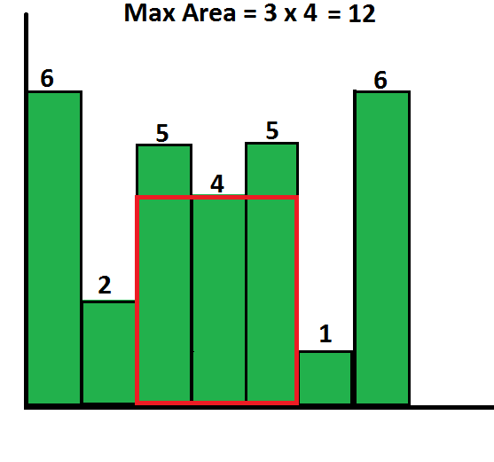

Stack
===================

1. - [x] <i> Nearest Greater to Left  (NGL) </i> 
2. - [x] <i> Nearest Greater to Right (NGR) </i>
3. - [x] <i> Nearest Smaller to Left  (NSL) </i>
4. - [x] <i> Nearest Smaller to Right (NSR) </i>
5. - [x] Stock Span Problem
6. - [x] Maximum Area Of Histogram
7. - [x] Maximum Area of Rectangle in Binary Matrix
8. - [x] Rain water trapping
9. - [x] Implementing a Min Stack
10. - [ ] Implementing Stack Using Heap
11. - [ ]  The Celebrity Problem
12. - [ ]  Longest Valid Parenthesis
13. - [ ]  Iterative Tower Of Hanoi

# Nearest Smaller / Greater #
These problems require following things
1. Stack to store previous indexes
2. Output Array

## Nearest Greater @@ ##

For Right >> Traverse from END to START

For Left >> Traverse from START to END

| Steps | Condition                                       | Operation                                                                                                                                        |
|-------|-------------------------------------------------|--------------------------------------------------------------------------------------------------------------------------------------------------|
| 1st   | if stack.isEmpty                                | then ADD -1 to Output List                                                                                                                       |
| 2nd   | if stack.top GREATER_THAN current element       | then ADD stack.top Output List                                                                                                                   |
| 3rd   | if stack.top LESS_THAN EQUAL_TO current element | then POP() the stack until <ul><li>the stack is empty -> then 1st step</li><li>stack.top GREATER_THAN current element -> then 2nd step</li></ul> |
| 4th   |                                                 | stack.push current index                                                                                                                         |

For Right >> The output is revered

## Nearest Smaller @@ ##

For Right >> Traverse from END to START

For Left >> Traverse from START to END

| Steps | Condition                                          | Operation                                                                                                                                     |
|-------|----------------------------------------------------|-----------------------------------------------------------------------------------------------------------------------------------------------|
| 1st   | if stack.isEmpty                                   | then ADD -1 to Output List                                                                                                                    |
| 2nd   | if stack.top LESS_THAN current element             | then ADD stack.top Output List                                                                                                                |
| 3rd   | if stack.top GREATER_THAN EQUAL_TO current element | then POP() the stack until <ul><li>the stack is empty -> then 1st step</li><li>stack.top LESS_THAN current element -> then 2nd step</li></ul> |
| 4th   |                                                    | stack.push current index                                                                                                                      |

For Right >> The output is revered

## Stock Span Problem ##
DEPENDS ON: Nearest Greater Left

Consecutive smaller or equal before it

Additional step: forEach(index -> index - results.get(index))

## Maximum Area of Histogram ##
DEPENDS ON: Nearest Smaller to Left + Nearest Smaller to Right 

</img>

## Maximum Area of Rectangle ##
DEPENDS ON: Maximum Area Of Histogram

</img>

Approach : Convert 2D histogram to 1D and calculate the area of histogram

| Steps | Description                                                                       |
|-------|-----------------------------------------------------------------------------------|
| 1st   | Get 1D Histogram                                                                  |
| 2nd   | Get 1D Area of 1st Histogram                                                      |
| 3rd   | Calculate are of subsequent 1D Histograms and add it to the previous 1D histogram | 
| 4th   | Make the histogram bar as zero if current element in 2D array is 0                |
| 5th   | Calculate are of the new Histogram                                                |

## Rain water Trapping ##
Greatest to Left + Greatest to Right 

## Minimum Stack ##

1. StackWithExtraSpace
2. StackWithoutExtraSpace
